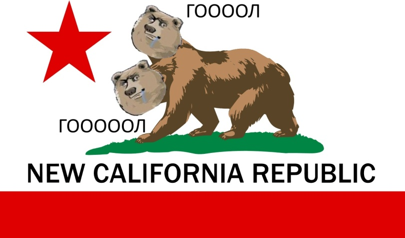

<div align="center">
    <h1>Cargocraft</h1>
    
</div>

Инструкция по сборке клиента/сервера:
---
Необходимые инструменты и пакеты для работы скриптов:
* jq
* mrpack-install
* packwiz
* wget
* zip
```bash
# 1) Выбрать директорию вне папки модпака
# 2) Запустить скрипт находясь в ней
# Параметры:
# (опциональный) -m/--modpack <путь до модпака>
# (опциональный) -d/destination-folder <путь до папки назначения>
# -h/--help помощь, выводит эту справку

# Для клиента:
ПУТЬ_ДО_МОДПАКА/mkclient.sh <параметры>
# или для сервера:
ПУТЬ_ДО_МОДПАКА/mkserver.sh <параметры>

# Генерирует файлы необходимые для запуска клиента/сервера в папке dist
```

Ссылки на загрузку Java:
---
[Temurin JRE 17](https://github.com/adoptium/temurin17-binaries/releases/download/jdk-17.0.11%2B9/OpenJDK17U-jre_x64_windows_hotspot_17.0.11_9.msi)

Тематика модпака:
---
В модпаке присутствует множество аддонов для `Create`, `Eureka` и `Valkirien Skies` в том числе:
* `Big Cannons`
* `Crafts & Additions`
* `Diesel Generators`
* `Enchantment Industry`
* `Mechanical Extruder`
* `Ore Excavation`
* `Slice & Dice`
* `Create Utilities`
* `Aquatic Ambitions`
* `Bells & Whistles`
* `Central Kitchen`
* etc.

Моды на генерацию ландшафта:
* `Integrated API`
* `Regions unexplored`
* `Quark`
* Различные датапаки на структуры

И ещё куча вспомогательных штук которые я устану перечислять
(Для тех кому особенно неймётся есть `Ad astra`)

